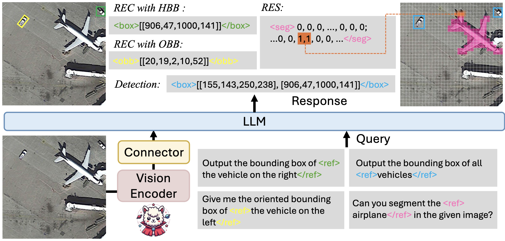
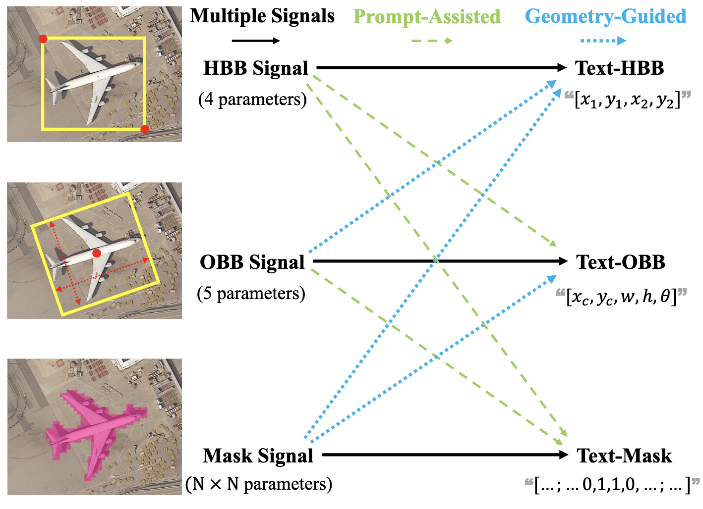
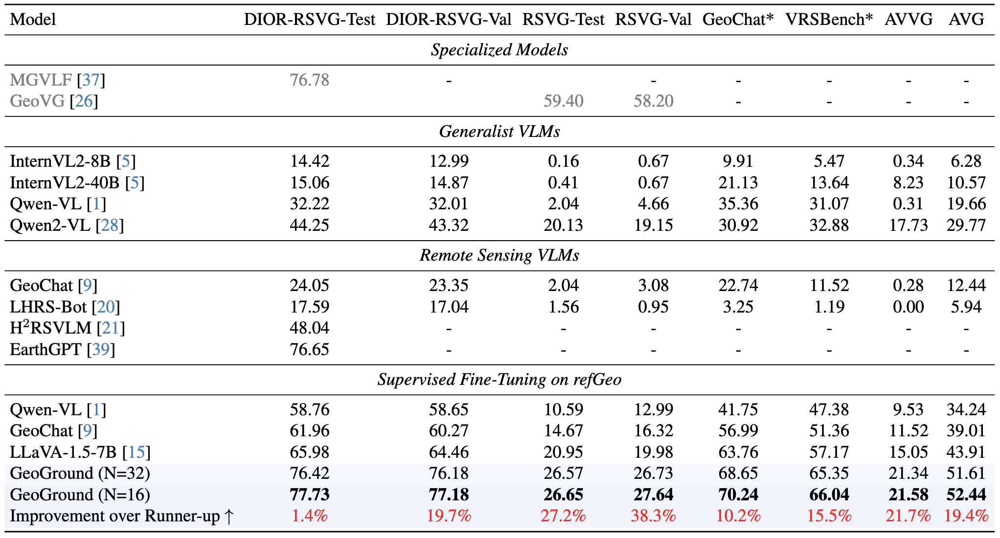
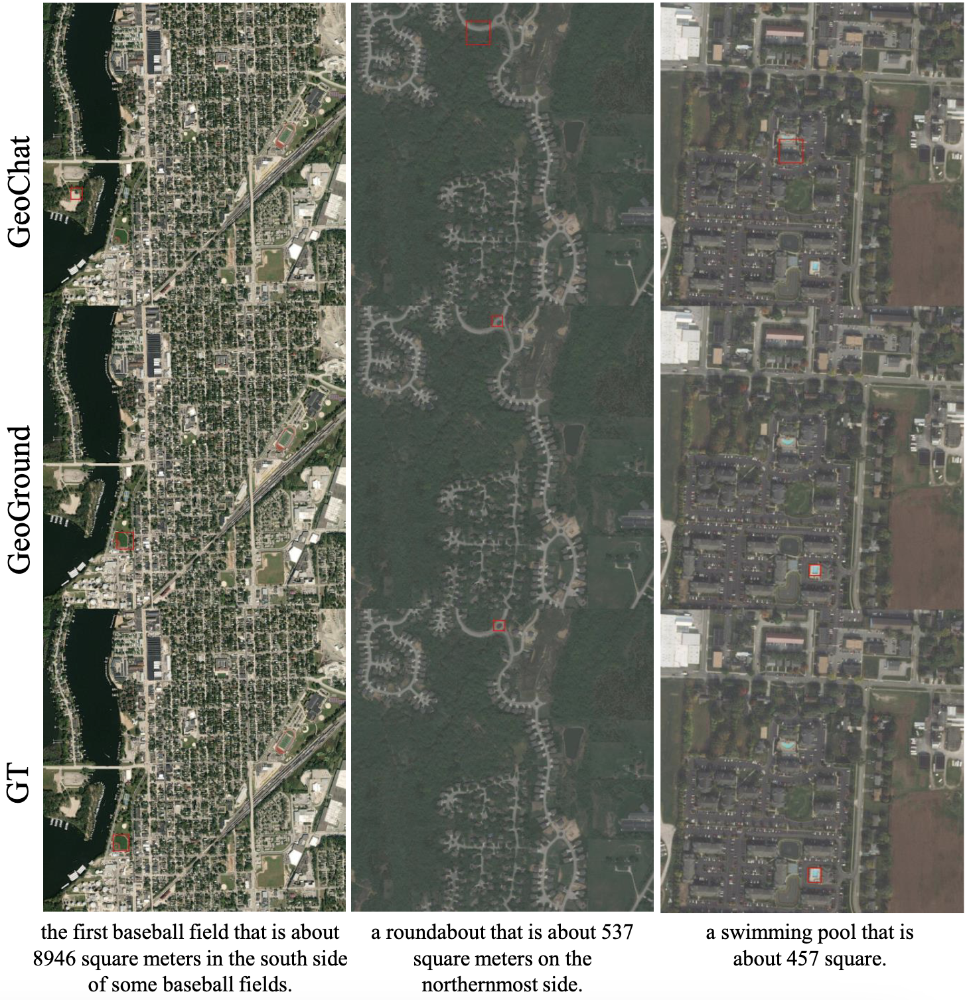
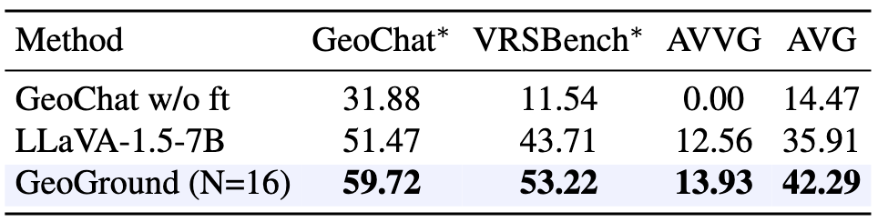
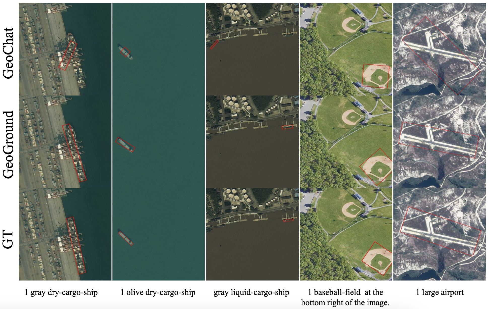
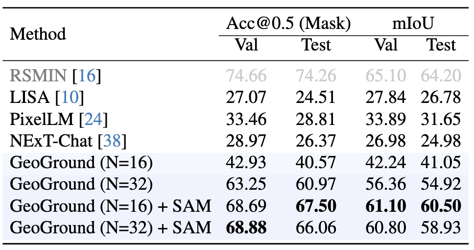
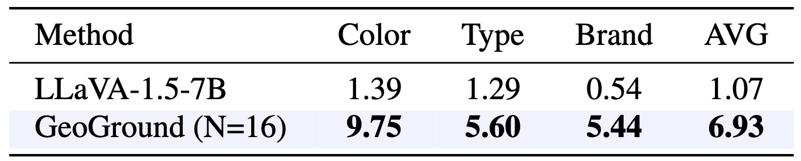

<div align="center">
<h1>Text4Seg: Reimagining Image Segmentation as Text Generation</h1>

<div>
    <a href='https://zytx121.github.io/' target='_blank'>Yue Zhou</a><sup>1</sup>&emsp;   
    <a href='https://mc-lan.github.io/' target='_blank'>Mengcheng Lan</a><sup>1</sup>&emsp;
    <a href='https://xiangli.ac.cn/' target='_blank'>Xiang Li</a><sup>2</sup>&emsp;
    <a href='https://keyiping.wixsite.com/index' target='_blank'>Yiping Ke</a><sup>3</sup>&emsp;
    <a href='https://ee.sjtu.edu.cn/FacultyDetail.aspx?id=53&infoid=66' target='_blank'>Jiang Xue</a><sup>4</sup>&emsp;
    <a href='https://scholar.google.com.hk/citations?user=PnNAAasAAAAJ&hl=en' target='_blank'>Litong Feng</a><sup>5</sup>&emsp;
    <a href='https://www.statfe.com/' target='_blank'>Wayne Zhang</a><sup>5</sup>&emsp;
</div>
<div>
    <sup>1</sup>S-Lab, Nanyang Technological University&emsp; 
    <sup>2</sup>CS, University of Reading&emsp; 
    <sup>3</sup>CCDS, Nanyang Technological University&emsp; 
    <sup>4</sup>SEIEE, Shanghai Jiaotong University&emsp; 
    <sup>5</sup>SenseTime Research&emsp;
</div>

[]()
[]()
[](http://arxiv.org/abs/)


</div>

<p align="center">
    
</p>

---

## 📢 Latest Updates

- 🌟 We will release the GeoGround demo, code and datasets as soon as possible. 🌟

---

## Abstract

*Remote sensing (RS) visual grounding aims to use natural language expression to locate specific objects (in the form of the bounding box or segmentation mask) in RS images, enhancing human interaction with intelligent RS interpretation systems. Early research in this area was primarily based on horizontal bounding boxes (HBBs), but as more diverse RS datasets have become available, tasks involving oriented bounding boxes (OBBs) and segmentation masks have emerged. In practical applications, different targets require different grounding types: HBB can localize an object's position, OBB provides its orientation, and mask depicts its shape. However, existing specialized methods are typically tailored to a single type of RS visual grounding task and are hard to generalize across tasks. In contrast, large vision-language models (VLMs) exhibit powerful multi-task learning capabilities but struggle to handle dense prediction tasks like segmentation. This paper proposes GeoGround, a novel framework that unifies support for HBB, OBB, and mask RS visual grounding tasks, allowing flexible output selection. Rather than customizing the architecture of VLM, our work aims to elegantly support pixel-level visual grounding output through the Text-Mask technique. We define prompt-assisted and geometry-guided learning to enhance consistency across different signals. To support model training, we present refGeo, a large-scale RS visual instruction-following dataset containing 161k image-text pairs. Experimental results show that GeoGround demonstrates strong performance across four RS visual grounding tasks, matching or surpassing the performance of specialized methods on multiple benchmarks.*

<div align="center">
  
  <div style="display: inline-block; color: #999; padding: 2px;">
      An overview of GeoGround -- the first model to unify box-level and pixel-level visual grounding tasks in remote sensing.
  </div>
</div>

---

## 🏆 Contributions

- **Framework.** We propose GeoGround, a novel VLM framework that unifies box-level and pixel-level RS visual grounding tasks while maintaining its inherent dialogue and image understanding capabilities.

- **Dataset.** We introduce refGeo, the largest RS visual grounding instruction-following dataset, consisting of 161k image-text pairs and 80k RS images, including a new 3D-aware aerial vehicle visual grounding dataset.

- **Benchmark.** We conduct extensive experiments on various RS visual grounding tasks, providing valuable insights for future RS VLM research and opening new avenues for research in RS visual grounding.

---

## 💬 Text-Mask & Hybrid Supervision

We propose the Text-Mask paradigm, which distills and compresses the information embedded in the mask into a compact text sequence that can be efficiently learned by VLMs. Additionally, we introduce hybrid supervision, which incorporates prompt-assisted learning (PAL) and geometry-guided learning (GGL) to fine-tune the model using three types of signals, ensuring output consistency and enhancing the model’s understanding of the relationships between different grounding types.
<p align="center">
  
</p>

---

## 🔍 refGeo Dataset

We introduce refGeo, a large-scale RS visual grounding instruction-following dataset. refGeo consolidates four existing visual grounding datasets from RS and introduces a new aerial vehicle visual grounding dataset (AVVG). AVVG extends traditional 2D visual grounding to a 3D context, enabling VLMs to perceive 3D space from 2D aerial imagery. For each referred object, we provide HBB, OBB, and mask, with the latter automatically generated by the SAM.

<p align="center">
  
</p>

---

## 🚀 Qualitative and Quantitative results

### 📷 Referring Expression Comprehension (REC) (HBB)
TextSeg can be directly applied in object detection with a simple mask2box paradigm, which first generates a segmentation mask based on the input and then derives the bounding box from the mask.

<div align="center">
  
</div>


<div align="center">
  
  <div style="display: inline-block; color: #999; padding: 2px;">
      Performance on RSVG benchmark.
  </div>
</div>

---

### 📷 Referring Expression Comprehension (REC) (OBB)
TextSeg can be directly applied in object detection with a simple mask2box paradigm, which first generates a segmentation mask based on the input and then derives the bounding box from the mask.

<div align="center">
  
</div>


<div align="center">
  
  <div style="display: inline-block; color: #999; padding: 2px;">
      Performance on GeoChat benchmark.
  </div>
</div>

---

### 📷 Referring Expression Segmentation (RES)

<div align="center">
  
</div>

<div align="center">
  
  <div style="display: inline-block; color: #999; padding: 2px;">
      Performance on RRSIS-D benchmark.
  </div>
</div>

---

### 📷 Generalized Referring Expression Comprehension (GRES) (Multiple Targets)

<div align="center">
  
</div>

---

 ### 📷 Image Captioning & Visual Question Answering (VQA)

<div align="center">
  
</div>


## 📜 Citation
```bibtex
@misc{lan2024text4seg,
      title={GeoGround: A Unified Large Vision-Language Model for Remote Sensing Visual Grounding}, 
      author={Yue Zhou and Mengcheng Lan and Xiang Li and Yiping Ke and and Xue Jiang and Litong Feng and Wayne Zhang},
      year={2024},
      eprint={},
      archivePrefix={arXiv},
      primaryClass={cs.CV},
      url={https://arxiv.org/abs/}, 
}
```

---
## 🙏 Acknowledgement

